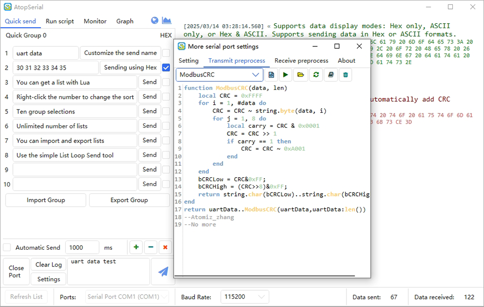

# AtopSerial  
***

[中文简介](https://github.com/mt6595/AtopSerial/blob/main/README_ZH.md)
This is a truly universal protocol parsing serial port tool, a highly flexible automation control and testing tool based on Lua scripting, and an all-encompassing virtual oscilloscope tool for the embedded industry. It supports both Chinese and English language switching, is ad-free, has no internal links, and is completely free of charge.

## Download
The project has been open sourced since [V2.3.0.0](https://github.com/mt6595/AtopSerial/releases/tag/V2.3.0.0), You can get the latest release binary from this link [V2.3.0.1](https://github.com/mt6595/AtopSerial/releases/tag/V2.3.0.1)

If you are a C# developer, you can get the source code from this link[AtopSerial Source](https://codeload.github.com/mt6595/AtopSerial/zip/refs/heads/main)

## Features & Functions
- Supports both Chinese and English languages.

- Ten groups of quick command sets with customizable names, supporting list import and export. Each command in the list can be customized with a name.

- A simple list loop sending tool (advanced loops can be implemented via Lua scripts).

- Supports custom baud rate, data bit length, stop bit length, parity bit type, Request To Send (RTS), and Data Terminal Ready (DTR).

- Supports data display modes: Hex only, ASCII only, or Hex & ASCII. Supports sending data in Hex or ASCII formats.

- Flexible data transmission and reception area, allowing data search via Ctrl+F and font size adjustment via Ctrl + mouse wheel.

- Supports sending escape characters such as \0, \r, \n, \t, and \\.

- Statistics for sent and received bytes.

- Supports multiple character encoding and decoding.

- Permanent data log recording.

- Supports automatic reconnection after disconnection.

- Pre-processing Lua scripts for sending and receiving, allowing free parsing or encoding of any protocol, as well as conversion to curves.

- Support curves picture copy and curves picture export

- Support curves data import and export

- curves support a variety of theme modifications

- Up to ten curve channels with up to 100000 data points per channel

- Run script panel: Custom Lua scripts for automated serial port control logic.

- Monitro panel: Custom Lua scripts for long-term data collection and logging to CSV files.

- Graph panel: Custom Lua scripts for rich embedded debugging and snatch graph  function.

## Curve Interface Operation Instructions
- Left mouse button + drag: Pan the curve along the X/Y axis.

- Ctrl + left mouse button + drag: Pan the curve along the X axis.

- Shift + left mouse button + drag: Pan the curve along the Y axis.

- Right mouse button + drag: Zoom the curve along the X/Y axis.

- Ctrl + right mouse button + drag: Zoom the curve along the X axis.

- Shift + right mouse button + drag: Zoom the curve along the Y axis.

- Mouse wheel scroll: Zoom the curve proportionally along the X/Y axis.

- Mouse wheel button + drag: Zoom into the selected area.

- Mouse wheel click: Auto-fit the curve view.

- Right mouse button click: Open the curve menu.

## Curve Menu Functions
- Copy Image: Copy the curve image to the clipboard.

- Save Image: Save the curve image as a PNG file.

- Export Data: Export the collected data as a CSV file.

- Import data:Import CSV file data into the curve.
`You can import curves by dragging the CSV file into the window.`

- Clear Curve: Clear the currently displayed curve.

- Fit View: Auto-fit the curve view (same effect as clicking the mouse wheel).

- Generate Demo: Generate three sine curves for software demonstration purposes.

- Switch Theme: Change the display style of the screenshot interface, including grid style, font, background color, etc.

## Interface

## Lua Script Document
📔 Lua 5.3 Reference Manual [Click Here](https://www.lua.org/manual/5.3/)

📖 Lua AtopSerial Tool API manual [Click Here](https://github.com/mt6595/AtopSerial/blob/main/LuaApi.md)

📚 If you are a C# developer, you need to know about Lua support in C# [Click Here](https://github.com/Tencent/xLua)

## About Digital Signatures
This software is an open-source project with no source of income, so we are unable to apply for a digital signature for the executable files. When running the application, you may encounter virus interception or security warnings about the publisher not being verified. You can refer to the following methods to resolve this issue:

- **Generate the Executable from Source Code**: You can obtain the source code from this repository and compile it yourself to ensure the security of the software.

- **Bypass Windows Warning**: If you trust this software, you can bypass the unsigned warning from Windows by following these steps:
 1. Right-click on the executable file.
 2. Select "Properties."
 3. In the "General" tab, check "Unblock."
 4. Click "OK" and run the software.

## Letter of Thanks
I am engaged in firmware development in the power supply industry and have no knowledge of C# development. Relying on five years of experience as a "copy-and-paste tailor," I spent dozens of days and nights modifying the LLCOM open-source project by ChenXuuu. Special thanks to the following open-source projects for their assistance:
- [LLCOM](https://github.com/chenxuuu/llcom)
- [ScottPlot](https://github.com/ScottPlot/ScottPlot)
- [AvalonEdit](https://github.com/icsharpcode/AvalonEdit)
- [HandyControl](https://github.com/HandyOrg/HandyControl)
- [xLua](https://github.com/Tencent/xLua)
- [Costura.Fody](https://github.com/Fody/Costura)
- [Fontawesome](https://fontawesome.com/)
- [iconfont](https://www.iconfont.cn/)

## Technical Supports
- 🛠️[GitHub Issue](https://github.com/mt6595/AtopSerial/issues)
- 🛠️[GitCode Issue](https://gitcode.com/mt6595/AtopSerial/issues)
- 📫Email `1012560534@qq.com`

## License
AtopSerial is licensed under [Apache 2](https://github.com/mt6595/AtopSerial/blob/main/LICENSE). If you use or borrow any part of this project, please retain a link pointing to the original project.Let me know if you need further assistance!