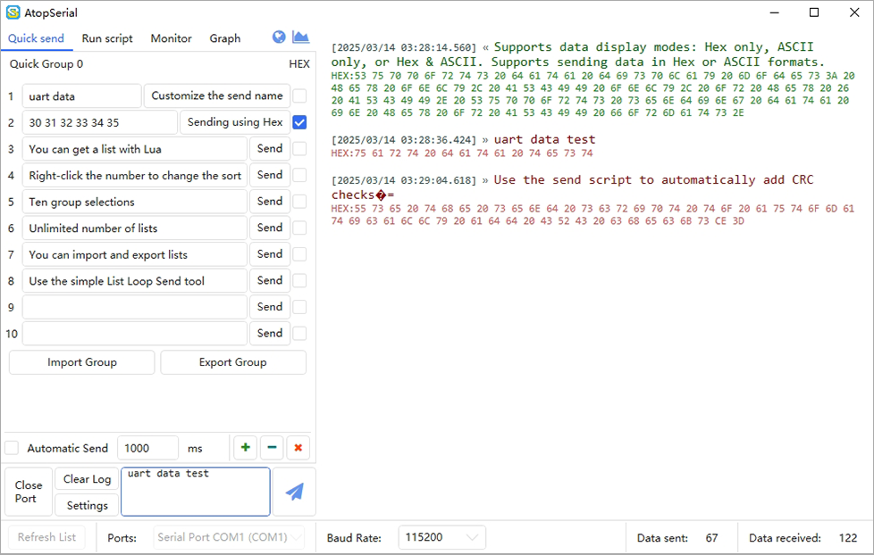
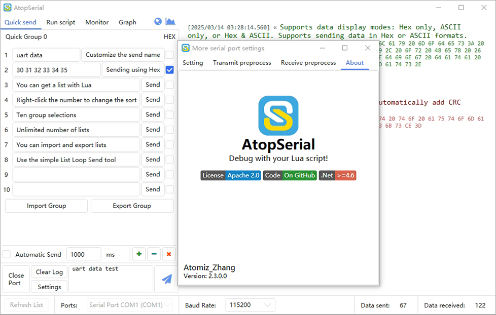
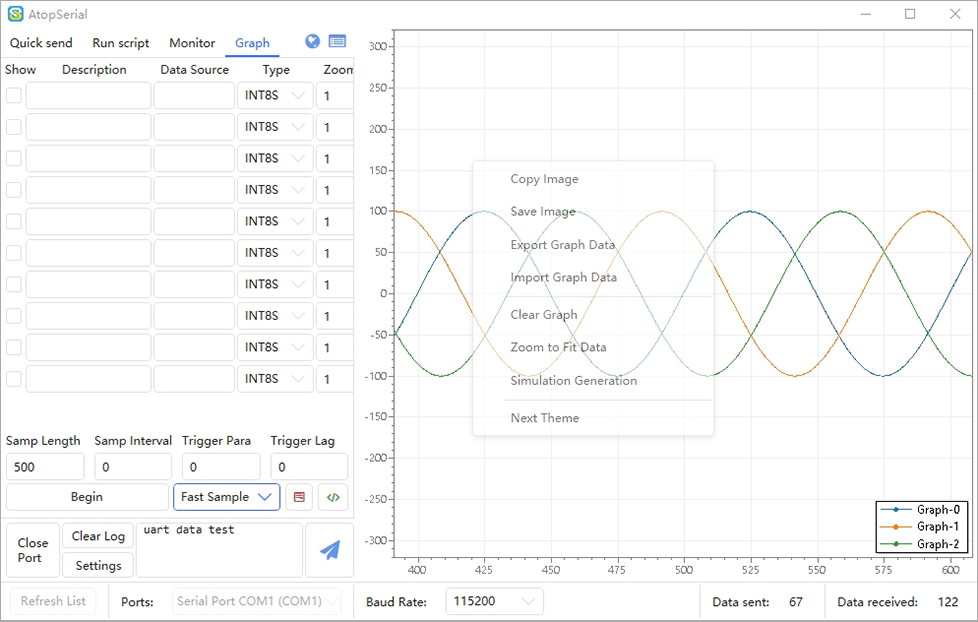

# AtopSerial  
***

[English Description](https://github.com/mt6595/AtopSerial/blob/main/README.md)
这是一个真正的万能协议解析串口工具，一个基于Lua脚本的高度灵活的自动化控制和测试工具，以及一个用于嵌入式行业的全功能虚拟示波器工具，项目在GitHub和GitCode开源。它支持中英文双语切换，无广告，无内链，无收费。

## 下载
该项目从[V2.3.0.0](https://github.com/mt6595/AtopSerial/releases/tag/V2.3.0.0)开始开源，您可以从这个链接[V2.3.0.3](https://github.com/mt6595/AtopSerial/releases/tag/V2.3.0.3)获得最新的发布二进制文件。

如果您是c#开发人员，您可以从这个链接[AtopSerial Source](https://codeload.github.com/mt6595/AtopSerial/zip/refs/heads/main)获得源代码。
## 功能&特点
- 支持中文和英文双语切换。

- 十组快捷数据发送组，可自定义名称，支持列表导入和导出。列表中的每个命令都可以自定义名称。

- 一个简单的列表循环发送工具（高级循环功能可以通过Lua脚本实现）。

- 支持自定义波特率、自定义数据位长度、自定义停止位长度、自定义校验位类型、自定义RTS （Request To Send）和DTR （data Terminal Ready）。

- 支持数据显示方式：Hex only、ASCII only、Hex & ASCII。支持以十六进制或ASCII格式发送数据。

- 灵活的数据传输和接收区域，可以通过Ctrl+F搜索数据，Ctrl+鼠标滚轮调整字体大小。

- 支持发送转义字符，如\0、\r、\n、\t、\\。

- 发送和接收字节数统计。

- 支持多字符编码和解码。

- 永久的数据日志记录。

- 支持断开连接后自动重新连接。

- 预处理用于发送和接收的Lua脚本，允许自由解析或编码任何协议，以及转换为曲线。

- 支持曲线图片复制和曲线图片导出

- 支持曲线数据的导入导出

- 曲线支持多种主题修改

- 多达10个曲线通道，每个通道高达100000数据点

- 运行脚本分栏：用于自动化串口控制逻辑的自定义Lua脚本。

- 数据监控分栏：自定义Lua脚本，用于长期数据收集和记录到CSV文件。

- 抓图工具分栏：自定义Lua脚本，用于丰富的嵌入式调试和抓图功能。

## 曲线界面操作说明
- 鼠标左键+拖动：沿X/Y轴平移曲线。

- Ctrl +鼠标左键+拖动：沿X轴平移曲线。

- Shift +鼠标左键+拖动：沿Y轴平移曲线。

- 鼠标右键+拖动：沿X/Y轴缩放曲线。

- Ctrl +鼠标右键+拖动：沿X轴缩放曲线。

- Shift +鼠标右键+拖动：沿Y轴缩放曲线。

- 鼠标滚轮滚动：沿X/Y轴按比例缩放曲线。

- 鼠标滚轮按钮+拖动：放大到选中的区域。

- 鼠标滚轮点击：自动拟合曲线视图。

- 鼠标右键单击：打开曲线菜单。

## 曲线菜单功能
- 复制图像：将曲线图像复制到剪贴板。

- 保存图像：将曲线图像保存为PNG格式。

- 数据导出：将采集数据导出为CSV文件。

- 导入数据：将CSV文件中的数据导入曲线。
`也可以通过拖动CSV文件到窗口来导入曲线`

- 清除曲线：清除当前显示的曲线。

- 适应视图：自动适配曲线视图（效果与点击鼠标滚轮相同）。

- 生成演示：生成三条正弦曲线用于软件演示。

- 切换主题：改变截图界面的显示样式，包括网格样式、字体、背景色等。

## 界面

## Lua Script 文档
📔 Lua 5.3 参考手册 [点击这里](https://www.lua.org/manual/5.3/)

📖 AtopSerial Tool Lua  API 参考手册 [点击这里](https://github.com/mt6595/AtopSerial/blob/main/LuaApi.md)

📚 如果你是c#开发者，你需要了解c#对Lua的支持 [点击这里](https://github.com/Tencent/xLua)

## 关于数字签名
本软件是开源项目，没有盈利来源，我们无法为可执行文件申请数字签名。您在运行应用程序时，可能会碰到病毒拦截或者无法验证发布者的安全警告，您可以参考如下方法解决：

- **从源代码生成可执行文件**：你可以从本仓库获取源代码并自行编译，以确保软件的安全性。

- **绕过 Windows 警告**：如果你信任本软件，可以按照以下步骤绕过 Windows 的未签名警告：
 1. 右键点击可执行文件
 2. 选择“属性”
 3. 在“常规”选项卡中，勾选“解除锁定”
 4. 点击“确定”并运行软件

## 感谢信
本人从事电源行业固件开发，对c#开发没有任何了解。凭借五年的“Ctrl CV”的裁缝经验，花费了几十个日夜对LLCOM开源项目进行重构。特别感谢以下开源项目的帮助：
- [LLCOM](https://github.com/chenxuuu/llcom)
- [ScottPlot](https://github.com/ScottPlot/ScottPlot)
- [AvalonEdit](https://github.com/icsharpcode/AvalonEdit)
- [HandyControl](https://github.com/HandyOrg/HandyControl)
- [xLua](https://github.com/Tencent/xLua)
- [Costura.Fody](https://github.com/Fody/Costura)
- [Fontawesome](https://fontawesome.com/)
- [iconfont](https://www.iconfont.cn/)

## 技术支持
- 🛠️[GitHub Issue](https://github.com/mt6595/AtopSerial/issues)
- 🛠️[GitCode Issue](https://gitcode.com/mt6595/AtopSerial/issues)
- 📫Email `1012560534@qq.com`

## License
AtopSerial is licensed under [Apache 2](https://github.com/mt6595/AtopSerial/blob/main/LICENSE). If you use or borrow any part of this project, please retain a link pointing to the original project.Let me know if you need further assistance!
